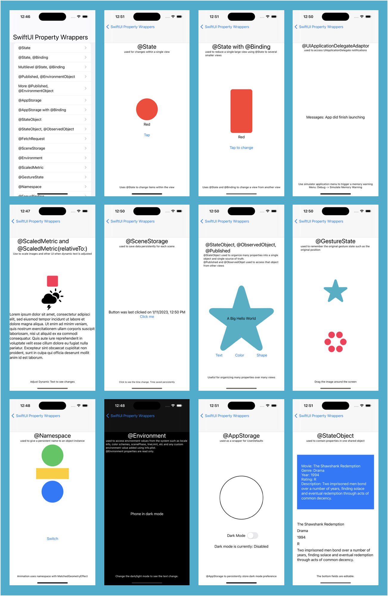

# SwiftUIPropertyWrappers

SwiftUI project that gives a code example of each SwiftUI property wrapper.

Project was made to demonstrate the use of SwiftUI's property wrappers. 

Example for: 
  * @State
  * @State with @Binding
  * @EnvironmentObject with @Published
  * @AppStorage
  * @AppStorage with @Binding
  * @StateObject
  * @StateObject with @ObservedObject
  * @SceneStorage
  * @Environment
  * @ScaledMetric
  * @GestureState
  * @NameSpace
  * @FocusBinding
  * @FocusValue
  * @UIApplicationDelegateAdaptor

**Technical Info:** \
Xcode 14 project written in Swift 5/SwiftUI for iOS 16\

**See Also:** \
[Quickies - a variety of example iOS apps](https://github.com/PepperoniJoe/Quickies)\
 [Make Icons Swiftly - used to generate app icon sets
 ](https://github.com/PepperoniJoe/Make-Icons-Swiftly)

**Author:** \
Marcy Vernon [@MarcyVernon](https://twitter.com/MarcyVernon)

**License:** \
"SwiftUI Property Wrappers" is under the MIT license. See [LICENSE](/LICENSE) for more information.
